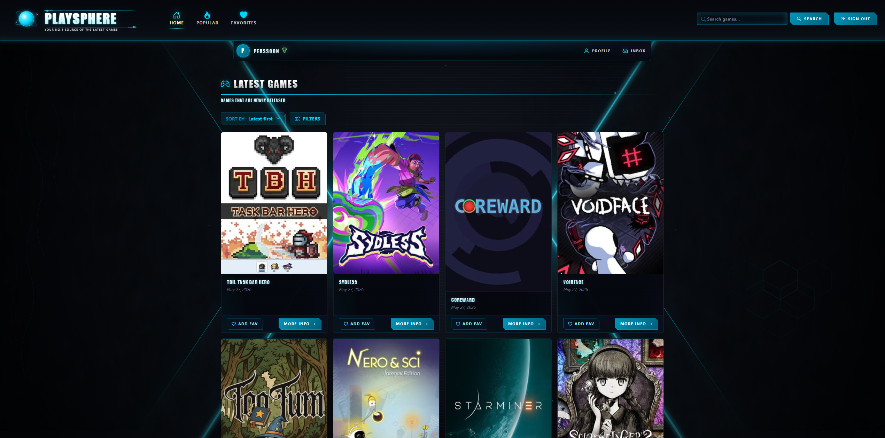
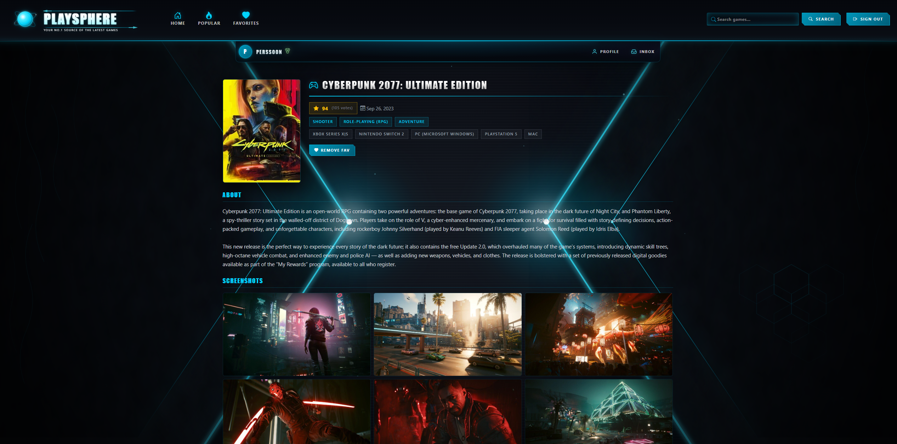
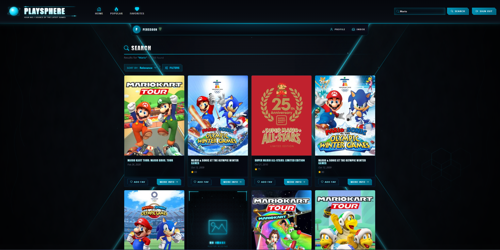
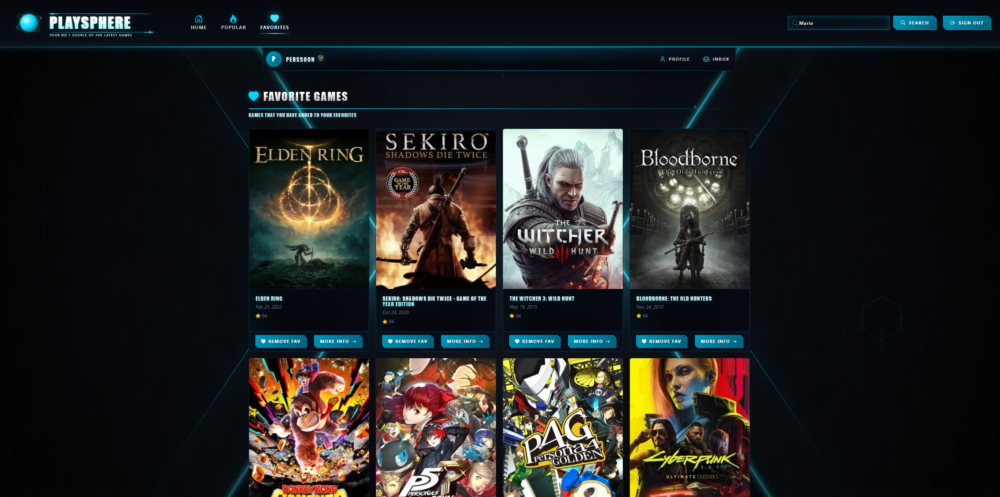

<div align="center">


# PlaySphere

**A web application for discovering games — built on .NET 10, Blazor Server and Clean Architecture.**

[](https://dotnet.microsoft.com/)
[](https://learn.microsoft.com/aspnet/core/blazor/)
[](https://learn.microsoft.com/ef/core/)
[](https://www.microsoft.com/sql-server)
[](https://xunit.net/)
[](#about-this-repository)

</div>

---

## About this repository

> This repository serves as a **public showcase** for PlaySphere. The full source code is kept private. If you'd like a code walkthrough or technical deep-dive, feel free to [reach out](#-contact).

PlaySphere was developed as my final project (examensarbete) for the two-year Higher Vocational Education in Backend Development at Yrkeshögskolan in Uddevalla, spring 2026.

---

## What is PlaySphere?

PlaySphere is a web application that lets users explore, search and save games from across the global games catalog. Game data is fetched in real time from **IGDB (Internet Games Database)** via their query language *Apicalypse*. User accounts, roles and favorites are stored in a dedicated SQL Server database.

The UI is built with **Blazor Server** and dressed in a cyber/neon visual identity that matches the gaming theme.

### Core features

- **Browse** the latest releases and most popular games
- **Search** the entire IGDB catalog with full-text queries
- **Filter** by genre, platform, release year and rating
- **Sort** results by relevance, rating, release date, name
- **Favorite** games to your personal profile and revisit them later
- **Multi-tier roles** — Member, VIP, Moderator, Administrator, Owner — each with their own badge and permissions
- **Account management** — register, log in, manage profile via ASP.NET Identity

---

## Screenshots

<div align="center">

<!-- Replace these placeholders with real screenshots once captured -->

*Home view — latest releases and popular games*


*Game detail page with cover art, summary and metadata*


*Search results with filter sidebar and sort dropdown*


*Personal favorites list*


</div>

---

## Tech stack

| Layer | Technologies |
|---|---|
| **Platform** | .NET 10, C# with nullable reference types |
| **UI** | Blazor Server (SignalR-driven), Razor components |
| **Persistence** | Entity Framework Core 10, SQL Server |
| **Authentication** | ASP.NET Core Identity (users, roles, policies) |
| **Validation** | FluentValidation |
| **Caching** | IMemoryCache with `GetOrCreateAsync` (atomic) |
| **External API** | IGDB via Apicalypse query language, Twitch OAuth |
| **Testing** | xUnit v3, NSubstitute, EF Core InMemory (~380 unit tests) |

---

## Architecture

PlaySphere follows **Clean Architecture** with four projects and a strict, inward-pointing dependency graph. The compiler enforces the direction — for example, EF Core cannot be used in the Application layer because the package isn't even referenced there.

```
┌─────────────────────────────────────────────────────────┐
│  PlaySphere.Web                                         │
│  Blazor components, pages, auth endpoints, Program.cs   │
└──────────────────────────┬──────────────────────────────┘
                           │ depends on
                           ▼
┌─────────────────────────────────────────────────────────┐
│  PlaySphere.Infrastructure                              │
│  EF Core, ASP.NET Identity, IGDB client, persistence    │
└──────────────────────────┬──────────────────────────────┘
                           │ depends on
                           ▼
┌─────────────────────────────────────────────────────────┐
│  PlaySphere.Application                                 │
│  Use cases, services, interfaces, validators, Result    │
└──────────────────────────┬──────────────────────────────┘
                           │ depends on
                           ▼
┌─────────────────────────────────────────────────────────┐
│  PlaySphere.Domain                                      │
│  Entities — no external dependencies                    │
└─────────────────────────────────────────────────────────┘
```

### Patterns and techniques worth highlighting

**Dependency inversion**
Interfaces like `IIgdbClient` and `IGameService` live in the Application layer and know nothing about HTTP, JSON or caching. Concrete implementations live in Infrastructure. This makes the entire data path swappable and unit-testable.

**Decorator pattern for caching**
`CachedGameService` wraps `GameService` and implements the same interface — caching is layered *on top of* the core logic, not inside it. Registered via keyed services in DI so the uncached variant is still resolvable for tests. The same pattern is repeated in `CachedIgdbClient` and `CachedGameCatalog`.

**Cache-first reads**
`IMemoryCache.GetOrCreateAsync` is atomic, which prevents cache stampedes. 100 concurrent requests against a cold cache result in **one** call to IGDB — the other 99 wait and receive the same value. TTL is tuned per data type: 30 min for popular and detail pages, 5 min for latest releases and search results.

**Result pattern instead of exceptions**
Expected errors (validation failures, "already exists", "not found") return `Result` objects rather than throwing. Exceptions are reserved for truly exceptional situations.

**Mode-switching IGDB client**
IGDB's Apicalypse query language has quirks — for example, `search` cannot be combined with `sort`. The client switches modes internally based on user input, hiding the limitation behind the clean `IIgdbClient` interface.

**Defensive EF Core**
SELECT projections fetch only the columns that are actually needed, instead of materializing whole entity graphs. Race conditions on unique inserts are handled by unique indexes plus a `DbUpdateException` catch on SQL Server error numbers 2601/2627 — the user doesn't care which click "won".

---

## Testing

Around **380 unit tests** written in xUnit v3 with NSubstitute for mocking and EF Core InMemory for `DbContext` tests. Tests follow strict rules:

- **One assert per test**
- **AAA structure** — Arrange, Act, Assert
- **No real external dependencies** — no live IGDB calls, no real database
- **Naming convention** — `MethodUnderTest_WhatHappens_ExpectedResult`, e.g. `GetLatestAsync_WhenCalledTwiceWithSameQuery_ShouldHitInnerOnce`

Caching logic, OAuth flows, Apicalypse query building, registration rollback — everything is tested in isolation, without a server.

---

## What I learned

**Strengths the architecture proved**
- *Testability* — separating cache from core logic via decorator made both trivially testable.
- *Consistency* — explicit coding rules from day one kept the entire codebase in the same style.
- *Replaceability* — `IIgdbClient` as an interface means swapping the external source wouldn't touch Application code.
- *Cache wins* — `/popular` went from ~400 ms cold to a few ms warm.

**Trade-offs I'd reconsider**
- *Blazor Server scalability* — each user maps to a SignalR circuit plus a scoped `DbContext`, which limits concurrent sessions.
- *Single external dependency* — if IGDB ever disappears, replacing it would be significant work.
- *Tests added too late* — I started writing tests after roughly 1/3 of the code was already written; some early decisions turned out to be hard to test retroactively. Next time: tests from line one.

---

## My role

Sole developer. I designed the architecture, implemented all four layers, wrote the tests, and shaped the visual identity. The project was developed as part of my YH thesis work during spring 2026.

---

## 📫 Contact

Interested in talking about the project, the code, or a potential collaboration?

- **Email:** [Perss00n@gmail.com](mailto:Perss00n@gmail.com)
- **Website:** [marcuslehm.se](https://marcuslehm.se)
- **GitHub:** [@Perss00n](https://github.com/Perss00n)

<div align="center">

— *Marcus Lehm · Spring 2026* —

</div>
